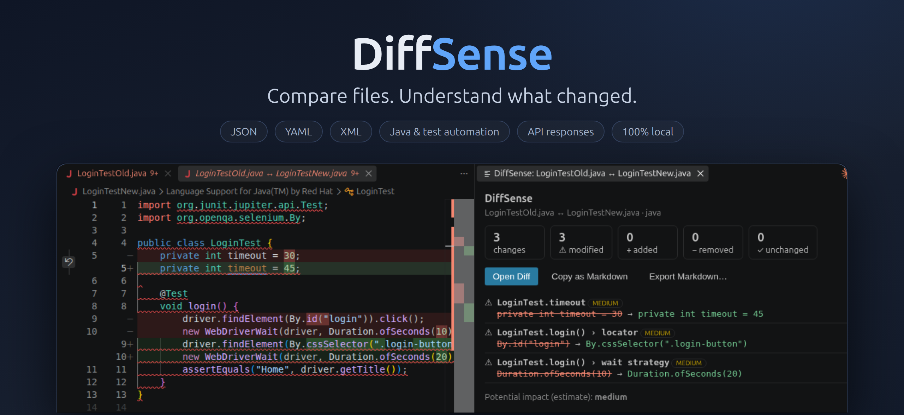

# DiffSense



Compare files. Understand what changed.

See [docs/DiffSense_Product_Requirements.md](docs/DiffSense_Product_Requirements.md) for the product requirements.

## Layout
- `packages/core` — VS Code-independent comparison engine (pure functions)
- `packages/cli` — thin CLI over the core (`diffsense compare a b`, `diffsense api expected actual`)
- `packages/vscode` — the VS Code extension
- `packages/intellij` — the IntelliJ plugin (Kotlin port of the engine; see its README)
- `conformance` — shared test cases that keep the TypeScript and Kotlin engines identical

## Develop
```
npm install
npm run build && npm run typecheck && npm test
```
Press F5 in VS Code to launch the extension in a development host.

## Package the extension
```
npm run build
npm run package -w diffsense-vscode      # produces a .vsix
```

## License
MIT
