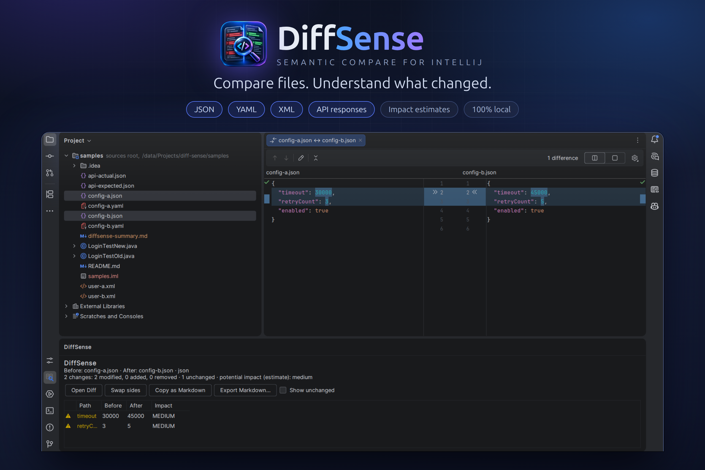

# DiffSense Semantic Compare for IntelliJ



**Compare files. Understand what changed.** This is the JetBrains IDE plugin. It uses the IDE's own diff viewer and adds a
summary tool window that lists what changed, by structure, with impact estimates.

## Features (0.1.0)

- **JSON, YAML, XML**: compared by structure. Reordered keys and reformatting are not changes; every changed value is listed with its path.
- **API responses**: expected vs actual (raw HTTP, JSON envelope or bare body) with a pass/fail verdict.
- **Text**: line diff for everything else.
- **Impact estimates** (informational to critical) with the reason for each.
- **Ignore rules**: Settings | Tools | DiffSense, or a `.diffsense.json` in the project root (same file as the VS Code extension).
- Copy or export the summary as Markdown.
- Fully local: no network access, no account, no telemetry.

Not in this release: Java semantic analysis and the test-automation rules (locators, waits, assertions). Java files are compared as text
and the tool window says so. These are planned for a later release.

## Use

- Select one or two files in the Project view, right-click, **Compare with DiffSense**. With one file selected you pick the second.
- **Tools | DiffSense**: Compare Files, Compare API Responses, Compare with Clipboard, Compare Selected Text.
- The **DiffSense** tool window shows the summary; **Swap sides** treats the right file as the "before" (the Project view passes
  multi-selected files in list order, not click order).

## Build and test

Requires JDK 21 and an installed IntelliJ IDEA (the build compiles against it instead of downloading an SDK):

```
./gradlew test                  # engine conformance + engine + headless IDE tests
./gradlew buildPlugin           # build/distributions/diffsense-intellij-<version>.zip
./gradlew verifyPlugin          # JetBrains plugin verifier against the local IDE
./gradlew runIde                # sandbox IDE with the sample files open
```

Set `-PideaPath=/path/to/idea` if IDEA is not at `/snap/intellij-idea-ultimate/current`. To try the plugin in your own IDE:
**Settings | Plugins | gear icon | Install Plugin from Disk...** and pick the zip.

## Keeping the engine in sync with the TypeScript core

The comparison engine (`src/main/kotlin/com/razatech/diffsense/engine`) is a Kotlin port of `packages/core`. Both must produce identical
results, so both run the shared cases in `conformance/cases.json` (changes, stats, impact, warnings and the rendered text/Markdown
summaries). When you change behaviour in `packages/core`, add a case to `conformance/inputs.mjs`, run `node conformance/generate.mjs`,
and make `ConformanceTest` pass here.

The build targets IDE build 262 (2026.2) because that is what it was verified against (`pluginSinceBuild`). Widen it after running
`verifyPlugin` against older IDEs.
